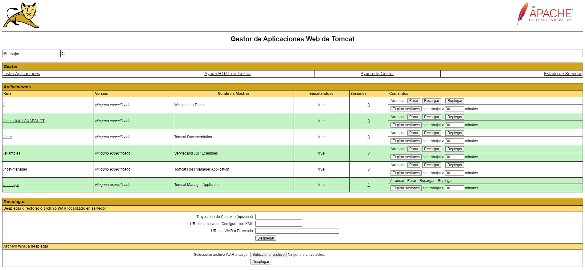

# OnboardingJava


## Getting started

1. Crear estructura del proyecto con spring initializr 
https://start.spring.io/

2. Configurar proyecto de esta manera:


3. Seguiremos la estructura MVC del proyecto seria la siguiente:


Donde tendremos 
* controller: almacenara todos los endpoints y lo asignara al servicio correspondiente
* dtos: sera donde se almacenen los objetos, el constructor los getters y setters
* repository: aqui estaran las sentencias sql
* service: donde recibiras el repositorio y haras todas las funciones que quieras realizar
* views donde se alojan las vistas


4. Deberemos disponer de un servidor tomcat para correr nuestro .war yo utilizare xampp para administrarlo
https://www.apachefriends.org/es/download.html

-Para poder utilizarlo deberemos descomentar unas lineas en el archivo tomcat-users.xml
```
<user username="admin" password="admin" roles="manager-gui"/>
```
5. Ya podremos acceder y añadir el archivo .war cuando lo generemos




6. Para generar este archivo deberemos acceder nuestro IDE en mi caso intellij y en la parte de maven pulsar en el package y arrancarlo


7. Tambien necesitamos tener mysql en nuestro equipo ya sea con un gestor como Dbeaver, Mysql workbench o como en mi caso tengo Xampp puedo utilizar phpmyadmin


